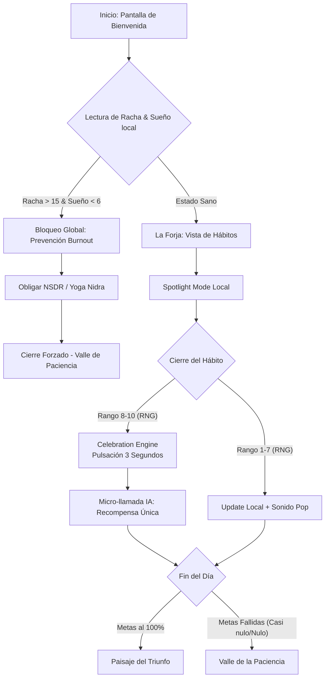

# 5. App Flow Document

## Project: ProfessionalStats

### 1. El Core Journey de la Interacción Diaria

A continuación se grafica el flujo desde que el usuario abarca la app en un día nuevo, demostrando la evaluación conductual.

### 2. Flujo de Navegación Estático
- `/` -> **Bienvenida** (Dato: `streak_count`, `daily_quote`)
- `/forge` -> **La Forja** (Dato: 4 estados de progreso granular)
- `/chronicle` -> **La Crónica** (Dato: Mapa de calor, Gráficos de Categoría y Logros pasados)
- `/bazaar` -> **El Bazar Empireo** (Dato: Personalización y Avatar upgrades)
